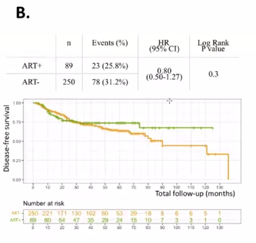

$$
\newcommand{\N}{{\mathbb{N}}}
\newcommand{\Z}{{\mathbb{Z}}}
\newcommand{\Q}{{\mathbb{Q}}}
\newcommand{\R}{{\mathbb{R}}}
\renewcommand{\C}{{\mathbb{C}}}
\renewcommand{\P}{{\mathbb{P}}}
\newcommand{\F}{{\mathbb{F}}}
\newcommand{\PP}{\text{П}}
\newcommand{\E}{{\mathbb{E}}}
\newcommand{\D}{{\mathbb{D}}}
\newcommand{\I}{{\mathbb{I}}}

\newcommand{\Pp}{\mathcal{P}}
\newcommand{\Oo}{\mathcal{O}}
\newcommand{\Hh}{\mathcal{H}}
\newcommand{\Aa}{\mathcal{A}}
\newcommand{\Cc}{\mathcal{C}}
\newcommand{\Xx}{\mathcal{X}}

\renewcommand{\O}{{\Omega}}
\newcommand{\G}{{\Gamma}}
\renewcommand{\a}{{\alpha}}
\renewcommand{\b}{{\beta}}
\newcommand{\g}{{\gamma}}
\renewcommand{\d}{{\delta}}
\newcommand{\e}{{\varepsilon}}
\renewcommand{\f}{{\varphi}}
\newcommand{\s}{{\sigma}}
\newcommand{\w}{{\omega}}
\renewcommand{\r}{{\rho}}
\renewcommand{\l}{{\lambda}}
\renewcommand{\k}{{\kappa}}
\renewcommand{\L}{{\Lambda}}
\renewcommand{\t}{{\theta}}

\newcommand{\red}[1]{{\color{red} #1}}
\newcommand{\blue}[1]{{\color{blue} #1}}
\newcommand{\green}[1]{{\color{green} #1}}
\newcommand{\purple}[1]{{\color{purple} #1}}
\newcommand{\orange}[1]{{\color{orange} #1}}
\renewcommand{\bold}[1]{\textbf{#1}}
\renewcommand{\vec}[1]{{\overrightarrow{#1}}}

\renewcommand{\leadsto}{{\ \Longrightarrow \ }}
\newcommand{\sat}{{\mapsto}}
\newcommand{\cons}{{\ \Rightarrow \ }}
\newcommand{\then}{{\ \Rightarrow \ }}
\newcommand{\hence}{{\ \Rightarrow \ }}
\newcommand{\means}{{\Rightarrow }}

\newcommand{\thesame}{{\ \Leftrightarrow \ }}
\newcommand{\<}{\leqslant}
\renewcommand{\>}{\geqslant}
\renewcommand{\=}{\equiv}
\newcommand{\9}{\Big(}
\newcommand{\0}{\Big)}
\newcommand{\calc}[2]{\Bigg|_{#1}^{#2}}
\newcommand{\dx}{\, dx}
\newcommand{\dt}{\, dt}
\newcommand{\dy}{\, dy}
\newcommand{\dz}{\, dz}
\newcommand{\du}{\, du}
\newcommand{\dv}{\, dv}
\newcommand{\df}{\, d \f}
\newcommand{\bs}{\Big[}
\newcommand{\be}{\Big]}

\renewcommand{\Im}{{\operatorname{Im}}}
\renewcommand{\Re}{{\operatorname{Re}}}
\newcommand{\im}{{\operatorname{Im}}}
\newcommand{\re}{{\operatorname{Re}}}
\newcommand{\rank}{\operatorname{rank}}
\newcommand{\con}{\operatorname{con}}
\newcommand{\tr}{\operatorname{tr}}
\newcommand{\trace}{\operatorname{trace}}
\newcommand{\sign}{\operatorname{sign}}
\newcommand{\dom}{\operatorname{dom}}
\newcommand{\ifff}{\operatorname{iff}}
\newcommand{\st}{\operatorname{s.t.}}
\newcommand{\diag}{\operatorname{diag}}
\newcommand{\prox}{\operatorname{prox}}
\newcommand{\proj}{\operatorname{proj}}
\newcommand{\const}{\operatorname{const}}
\newcommand{\span}{\operatorname{span}}
\newcommand{\var}{\operatorname{Var}}
\newcommand{\argmin}{\operatorname{argmin} \limits}
\newcommand{\argmax}{\operatorname{argmax} \limits}
\newcommand{\cov}{\operatorname{cov}}

\newcommand{\iid}{\text{i.i.d.}}
\newcommand{\else}{\text{else}}

\renewcommand{\exp}[1]{\operatorname{exp} \left \{ #1 \right \}}
\renewcommand{\eq}{= \\ =}
\newcommand{\shift}[1]{\Big\{ #1 \Big\}}
\newcommand{\set}[1]{\left \{ #1 \right \}}
\newcommand{\for}{\ | \ }
$$

# Анализ выживаемости. Продолжение

### Вспоминаем предыдущее занятие

Есть пациенты, больные раком. Некоторые умирают, некоторые излечиваются. А некоторые пропадают с радаров: они перестают ходить на ежегодные осмотры к врачу

Для анализа вводим две функции:

* Survival function: $s(t) = \P \set{T \> t} = 1 - F_T(t)$
* Hazard function: $h(t) =\lim {\P \set{t < T \< t + \Delta t \for T \> t} \over \Delta t}$. Является некоторым аналогом мгновенной функции.

Свойства:

* $h(t) = -{d \over dt} \log s(t)$

## Как оценивать survival function?

### Live-table estimate

 

* $n_i$ - сколько людей есть в $i$-ом интервале времени
* $d_i$ - сколько людей умерло в $i$-ом интервале
* $c_i$ - сколько людей наблюдались последний раз в $i$-ом интервале

Actual assumption:
$$
s^*(t) = \prod_{j=1}^k \left(1 - {d_j \over n_j'} \right), \quad n_j' = n_j - {c_j \over 2}
$$
На самом деле непонятно, почему не считать $n_j'$ как $n_j - {c_j + d_j \over 2}$ - видимо чисто исторические причины

### Kaplan-Meier estimate

Этот подход, в отличие от предыдущего, реально используется на практике. 

Пусть $t_j$ - момент смерти $j$-го пациента. Тогда в качестве оценки $s$ можно взять
$$
\hat s(t) = \prod_{j = 1}^k \left(1 - {d_j \over n_j} \right)
$$
По сути все отличие от предыдущей формулы в том, что мы вместо $n_j'$ написали $n_j$. Объясним, почему так можно сделать:
$$
\P\set{T > t_{(k)}} = \P \set{T > t_{(k)} \for T > t_{(k)} - \delta} \cdot \P \set{T > t_{(k)} - \delta \for T > t_{(k - 1)}} \cdot \P \set{T > t_{(k - 1)}}
$$

Между красными моментами никто не умирал. Тогда
$$
 \underbrace{\P \set{T > t_{(k)} \for T > t_{(k)} - \delta}}_{1 - \P \set{T = t_{(k)}} = 1 - {d_k \over n_k}} \cdot \underbrace{\P \set{T > t_{(k)} - \delta \for T > t_{(k - 1)}}}_{=1} \cdot {\P \set{T > t_{(k - 1)}}}
$$
Расписывая по индукции последнее слагаемое получаем требуемую формулу. 

Если посмотреть на формулу, то может возникнуть вопрос: а куда делись цензурируемые события? На самом деле, если положить $c_k = 0$, то получим:
$$
(\dots) =  {n_k - d_k \over n_k} \cdot {n_{k-1} - d_{k - 1} \over n_{k - 1}} \cdot \dots \cdot {n_1 - d_1 \over n_1} = {n_{k - 1} \over n_k} \cdot \dots \cdot {n_2 \over n_1} = {n_{k+1} \over n_1}
$$

### Пример из статьи

Изучается женская болезнь: рак матки. После того, как пациентке сделали операцию, он зачастую хочет родить ребенка. Исследуется вероятность возникновения рецидива (повторного возникновения болезни) в зависимости от некоторых факторов: 

* тип диагноза [A]

* роды ребенка проводятся по специальной технологии [B]

* факт рождения ребенка [C]
* применяется специальный курс лечения [D]

Соответственно, мы хотим проверить 4 гипотезы. 

Посмотрим на графики. Черточки - это моменты цензуирования. Те моменты, когда кривая прыгает - это либо момент наступления рецидива, либо же момент, когда человек перестает обследоваться.

## Оценка hazard function

Еще раз определение:
$$
h(t) =\lim {\P \set{t < T \< t + \Delta t \for T \> t} \over \Delta t}
$$

### Live-table estimate

$$
h^*(t) = {d_j \over n'_j \cdot (t_{j + 1} - t_j)}, \ \forall t \in [t_j, t_{j+1}],\quad n'_j = n_j - {d_j + c_j \over 2}
$$

### Kaplan-Meier

$$
\hat h(t) = {d_j \over n_j \cdot (t_{j + 1} - t_j)}
$$

### Что получилось в статье

Смысл hazard function - вероятность наступления рецидива, если раньше его не случалось. Видно, что для нашей задачи рецидив часто наступает через 1 год и через 7 лет.

## Сравнение групп

Есть две группы: 1 и 2. Их hazard functions: $h_1, h_2$. 

**Proportional hazard model:**
$$
h_2(t) = C \cdot h_1(t), \quad C > 0, \neq1
$$
В терминах функции выживаемости: соответствующие функции выживаемости $s_1, s_2$ не пересекаются во всех точках, где они одновременно не равны нулю или единице
$$
h(t) = -{d \over dt} \log s(t) \hence s(t) = \exp{-\int_0^t h(u) \du} 
\\ \hence s_2(t) =  \exp{-\int_0^t h_2(u) \du} = \exp{-\int_0^t C \cdot h_1(t) \dt} = (s_1(t))^2
$$
Если $s_1(t) = (s_1(t))^C \hence$ $s_1(t)$ либо 0, либо 1 (а это крайние значения). Значит, при предположении $h_2(t) = C \cdot h_1(t)$ графики $s(t)$ не пересекаются.

Для пациента номер $i$:
$$
h_i(t) = e^{\beta x_i} h_0(t), \quad x_1 = \begin{cases} 0, & \text{в первой группе} \\ 1, & \text{во второй группе} \end{cases}, \quad e^\beta = C, \quad h_0 = h_1
$$
По сути получили универсальный вид функции. Функцию $h_0$ часто называют baseline hazard. 

Функцию $h_i$ можно обобщить. Пусть $\vec x_i$ - вектор характеристик $i$-го пациента. Тогда
$$
h_i(t) = e^{\langle \bar \beta, \bar x_i \rangle} h_0(t)
$$
Обычно $x_i$ выбирают так, что когда они равны нулю, мы получаем элемент из первой группы.

Если присмотреться, то мы получили нечто вроде задачи регрессии. 

### Как оценить $\mathbf{\beta}$?

Введем аналог функции правдоподобии. Пусть $t_{(1)} < \dots < t_{(k)}$ - моменты когда кто-то умер (возник рецидив в нашей задаче). Рассмотрим функцию $L$:
$$
\begin{align*}
L(\bar \beta) &= \prod_{j = 1}^n \P \set{\text{пациент с характеристикой $\bar x_{j}$ умер в момент времени $t_{(j)}$} \for  \text{в момент $t_{(j)}$ есть $\>1$ смерть}} \\
&=\prod_{j=1}^n {\P{\text{пациент с хар. $\bar  x_j$ умер в момент $t_{(j)}$}} 
\over \sum_{s \in R(t_{(j)})} \P \set{x_s \text{ умер в момент $t_{(j)}$}}} \\
\text{где } R(t_{(j)}) & - \text{пациент в зоне риска в момент $t_{(j)} - \delta$} \\
(\dots) 
&= \prod_{j=1}^n {\P{\text{пациент с хар. $\bar  x_j$ умер в момент $t_{(j)}$}} / \delta
\over \sum_{s \in R(t_{(j)})} \P \set{x_s \text{ умер в $[t_{(j)} - \delta, t_{(j)}]$}} / \delta} \\

\end{align*}
$$
где $R(t_{(j)})$ - пациент в зоне риска в момент $t_{(j)} - \delta$. Далее,
$$
\begin{align*}
L(\bar \beta) &= \prod_{j=1}^n 
{\overbrace{\P{\text{пациент с хар. $\bar  x_j$ умер в момент $t_{(j)}$}}}^{\to h_j(t_{(j)})} / \delta
\over \sum_{s \in R(t_{(j)})} \underbrace{\P \set{x_s \text{ умер в $[t_{(j)} - \delta, t_{(j)}]$}} / \delta}_{\to h_s(t_{(j)})}} \\
& \to \prod_{j=1}^n  {h_j(t_{(j)}) \over \sum_{s \in R(t_{(j)})} hs(t_{(j)})} 
= \shift{h_i(t) = e^{\langle \bar \beta, \bar x_i \rangle} h_0(t)} \\ 
& = \prod_{j = 1}^n {e^{\langle \beta, x_j \rangle } \over \sum_{s \in R(t_{(j)})} e^{\langle \beta, x_s \rangle}} \\
& \to \max_\beta
\end{align*}
$$
Чтобы оценить $\beta$ надо максимизировать дробь по $\beta$. Допустим, мы научились максимизировать. Что делать дальше?

### Логранговый критерий (logrank test, score test)

Вещь, которую мы получим ниже, является в некотором смысле фундаментальной. Можно прийти к нему разными способами

#### Способ 1

$$
L(\beta) = \prod_{j = 1}^k {e^{\beta x_j} \over \sum_{s = 1}^{n_j}e^{\beta x_j}}
$$

где $n_j$ - количество людей в риске в момент $j$. Логорифмируем:
$$
\log L(\beta) = \beta \sum_{j=1}^n x_j - \sum_{j=1}^n \log \left(\sum_{s = 1}^{n_j} e^{\beta x_j} \right)
$$
Обозначим $d_2 := \sum_{j=1}^n x_j $ - общее количество умерших людей из второй группы. Вторую сумму распишем как $\sum_{j=1}^{n_j} e^{\beta x_s} = n_{1j} + n_{2j} e^\beta$. Поясняющая таблица:

| group | death at $j$          | number at rish at $j$ |
| ----- | --------------------- | --------------------- |
| 1     | $d_{1j}$              | $n_{1j}$              |
| 2     | $d_{2j}$              | $n_{2j}$              |
|       | $d_i = \sum_j d_{ij}$ |                       |

В новых обозначениях получаем:
$$
\log L(\beta) = \beta d_2 + \sum_{j=1}^n \log(n_{1j} + n_{2j} e^\beta)
$$
**Score test** проверяют гипотезу
$$
\Hh_0: \quad \beta = 0
$$
Статистика:
$$
{{{\partial \over \partial \beta} \log L(\beta)} \Big|_{\beta=0} \over - {\partial^2 \over \partial \beta^2} \log L(\beta) \Big|_{\beta = 0}} \sim \Xx_1^2
$$
Если $\beta = 0$, то получается группы одинаковые.

#### Способ 2

Вывод через гипергеометрическое распределение. Что это такое? Пусть есть $N$ объектов, $D$ из них отмечены. Мы берем $n$ из них. Тогда вероятность, что $d$ из них отмечены:
$$
\P\set{\text{отмеч.} = d} = {C_0^d C_{N - 0}^{n-d} \over C_N^n} \\
\E[\text{отмеч}] = {n \over N} D
$$

##### Лирическое отступление про пользу гипергеометрического распределения

Допустим у нас есть пруд и мы хотим оценить количество рыбы в нем. Первым шагом мы ловим $D$ рыб и отмечаем их, например вешая на них ленточку. Далее мы ловим $n$ рыб и смотрим сколько среди них отмеченных - получаем $d_1$. Повторяем эксперимент несколько раз - получаем числа $d_2, \dots d_m$. Теперь мы имеем выборку $d_1, \dots d_m$ и можем максимизировать функцию правдоподобия:
$$
\prod_{i=1}^m p(d \for n, D) \to  \max_N
$$

---

В нашем случае

* $N = \bar n_j = n_{1j} + n_{2j}$
* $D = \bar d_j = d_{1j} + d_{2j}$
* $n = n_{1j}$

Тогда 
$$
\P \set{\text{количество смертей в первой группе} = d_{1j}} = {C_{\bar d_j}^{d_{1j}} C_{\bar n_j - \bar d_j}^{n_{1j} - d_{1j}}\over C_{\bar n_j}^{n_{1j}}} \\
\E[\text{количество смертей в первой группе}] = {n_{1j} \over \bar n_j} \bar d_j
$$
Как померить отклонения наблюдаемых отклонений от ожидаемых?
$$
U_L = \sum_{j=1}^n \left(d_{1j} - {n_{1j} \over \bar n_j} \bar d_j \right) = d_1 - \sum_{j=1}^n {n_{1j} \over \bar n_j} \bar d_j 
$$
Можем вычислить некоторые статистики:
$$
\E U_L = 0, \quad \var U_L = \sum_{j=1}^n {n_{1j} \,n_{2j} \, \bar d_j (\bar n_j - \bar d_j) \over n_j^2 (n_j - 1)}
$$
**Утверждение**
$$
{U_L \over \sqrt \var U_L} \to \mathcal{N}(0, 1)
$$
Отсюда получаем
$$
{U_L^2 \over \var U_k} \to \Xx_1^2
$$
Что отсюда можем получить? Если в каждый момент у нас ровно одна смерть (то есть $\bar d_j = 1$), то формула, получаемая из гипергеометрического распределения, полностью совпадает с формулой выше.

### Пример из статьи

Наши функции не пересекаются до 120-го месяца. Вообще это плохо, но вроде как мы можем просто выкинуть эти наблюдения. Уровень значимости p-value=0.02  , что говорит о различии групп. Эти графики были для уровня диагноза и выглядят логично: чем диагноз хуже, тем вероятнее рецидив.

Уровень значимости больше 0.03, что говорит об одинаковости групп. Это соответствует мнению врачей: операция EKO не влияет на рецидив

Очень хороший уровень значимости. Лучше родить ребенка

Использование дополнительного лечения уменьшает вероятность рецидива. Это соответствует мнению врачей.

# На этом курс закончен!
