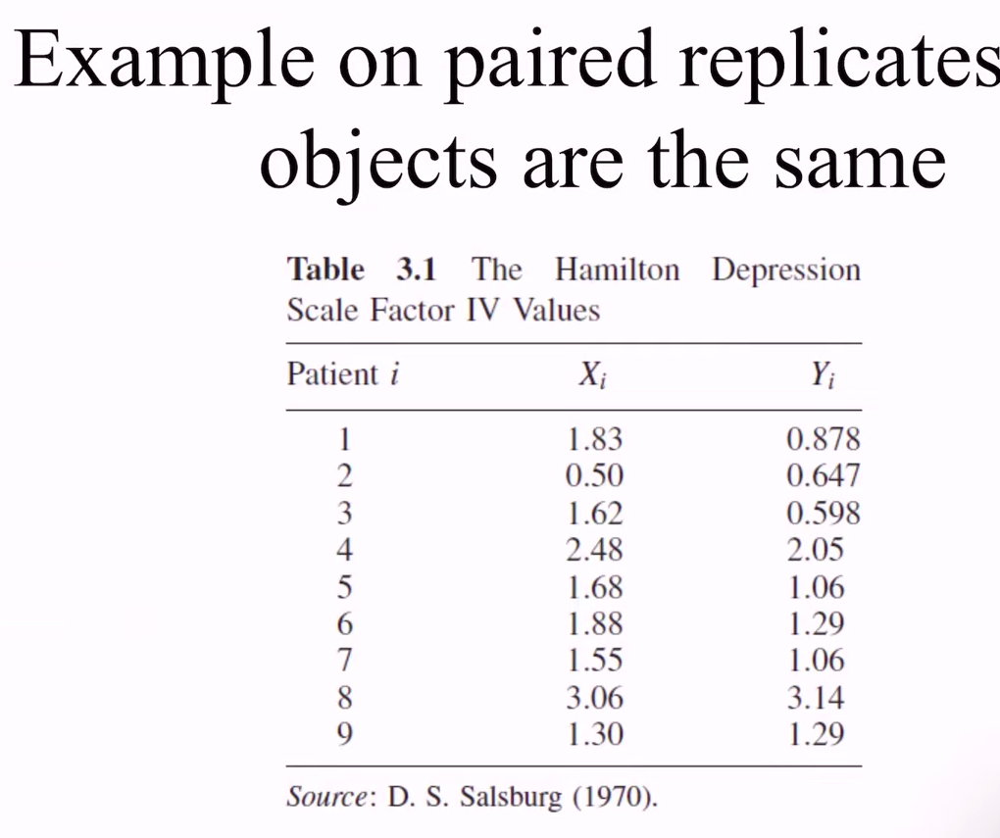
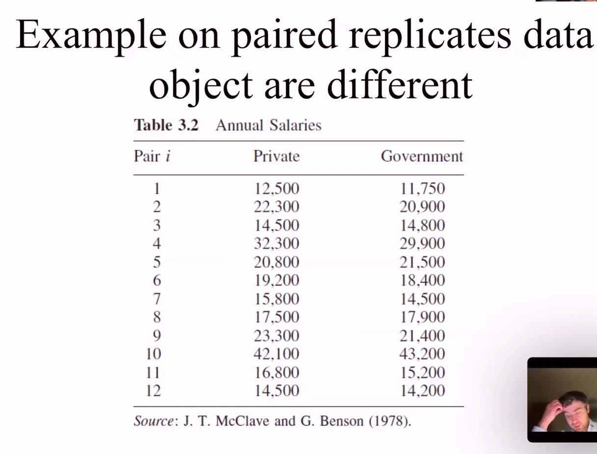
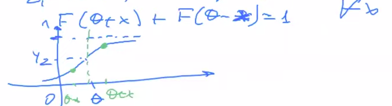
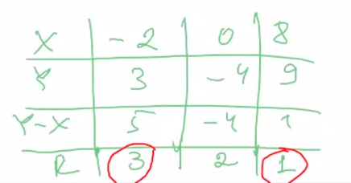
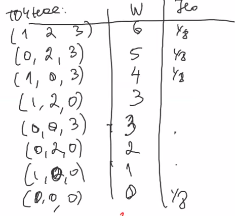
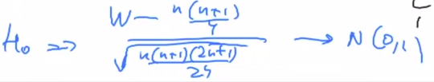
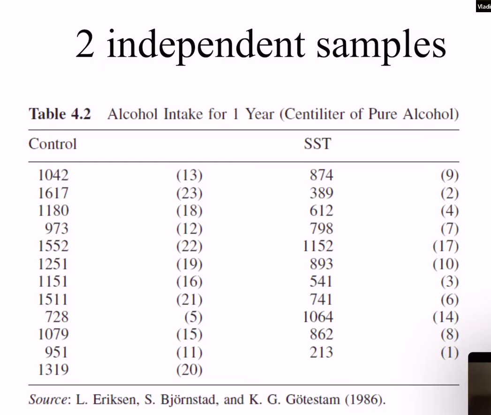
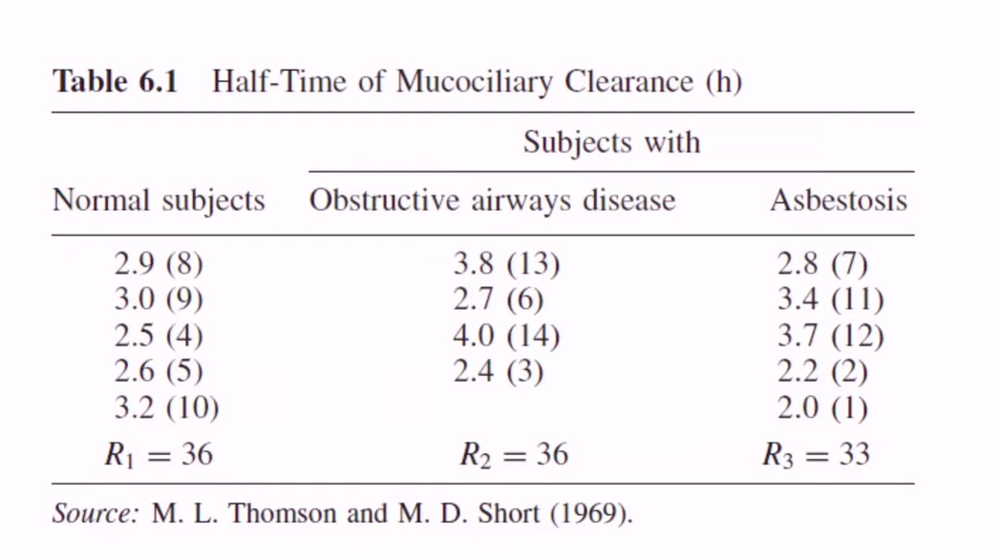

$$
\newcommand{\horline}{\noindent\rule{\textwidth}{0.4pt}}
\renewcommand{\line}{\\ \hline}

\newcommand{\N}{{\mathbb{N}}}
\newcommand{\Z}{{\mathbb{Z}}}
\newcommand{\Q}{{\mathbb{Q}}}
\newcommand{\R}{{\mathbb{R}}}
\renewcommand{\C}{{\mathbb{C}}}
\renewcommand{\P}{{\mathbb{P}}}
\newcommand{\F}{{\mathbb{F}}}
\newcommand{\PP}{\text{П}}
\newcommand{\E}{{\mathbb{E}}}
\newcommand{\D}{{\mathbb{D}}}
\newcommand{\I}{{\mathbb{I}}}

\newcommand{\Pp}{\mathcal{P}}
\newcommand{\Oo}{\mathcal{O}}
\newcommand{\Hh}{\mathcal{H}}
\newcommand{\Aa}{\mathcal{A}}
\newcommand{\Cc}{\mathcal{C}}
\newcommand{\Xx}{\mathcal{X}}

\renewcommand{\O}{{\Omega}}
\newcommand{\G}{{\Gamma}}
\renewcommand{\a}{{\alpha}}
\renewcommand{\b}{{\beta}}
\newcommand{\g}{{\gamma}}
\renewcommand{\d}{{\delta}}
\newcommand{\e}{{\varepsilon}}
\renewcommand{\f}{{\varphi}}
\newcommand{\s}{{\sigma}}
\newcommand{\w}{{\omega}}
\renewcommand{\r}{{\rho}}
\renewcommand{\l}{{\lambda}}
\renewcommand{\k}{{\kappa}}
\renewcommand{\L}{{\Lambda}}
\renewcommand{\t}{{\theta}}

\newcommand{\red}[1]{{\color{red} #1}}
\newcommand{\blue}[1]{{\color{blue} #1}}
\newcommand{\green}[1]{{\color{green} #1}}
\newcommand{\purple}[1]{{\color{purple} #1}}
\newcommand{\orange}[1]{{\color{orange} #1}}
\renewcommand{\bold}[1]{\textbf{#1}}
\renewcommand{\vec}[1]{{\overrightarrow{#1}}}
% \renewcommand{\inf}{{\infty}}

% \newenvironment{eqn}{ \begin{align} \begin{split} }{ \end{split} \end{align} }

% \newenvironment{eq}{\begin{align*}}{\end{align*}}

\newcommand{\arr}[1]{{\left[ \begin{array}{*{20}{>{\centering\arraybackslash}c}} #1 \end{array} \right]}}

\renewcommand{\table}[3]{\begin{center}\begin{tabular}{|*{#1}{>{\centering\arraybackslash}p{#2\textwidth}|}} \hline #3 \hline \end{tabular}\end{center}}

\newcommand{\tablea}[2]{\begin{center}\begin{tabular}{|*{#1}{>{\centering\arraybackslash}c|}} \hline #2 \hline \end{tabular}\end{center}}
  

% \forall \e > 0 \ \exists \d > 0 : \ \forall x \in O_\delta(x_0) \

\renewcommand{\leadsto}{{\ \Longrightarrow \ }}
\newcommand{\sat}{{\mapsto}}
\newcommand{\cons}{{\ \Rightarrow \ }}
\newcommand{\then}{{\ \Rightarrow \ }}
\newcommand{\hence}{{\ \Rightarrow \ }}

\newcommand{\thesame}{{\ \Leftrightarrow \ }}
\newcommand{\<}{\leqslant}
\renewcommand{\>}{\geqslant}
% \let\oldline\|
% \renewcommand{\#}{\oldline}
% \renewcommand{\|}{\Big|}
\renewcommand{\=}{\equiv}
\newcommand{\9}{\Big(}
\newcommand{\0}{\Big)}
\newcommand{\calc}[2]{\Bigg|_{#1}^{#2}}
\newcommand{\dx}{\, dx}
\newcommand{\dt}{\, dt}
\newcommand{\dy}{\, dy}
\newcommand{\dz}{\, dz}
\newcommand{\du}{\, du}
\newcommand{\dv}{\, dv}
\newcommand{\df}{\, d \f}
\newcommand{\bs}{\Big[}
\newcommand{\be}{\Big]}

\renewcommand{\Im}{{\operatorname{Im}}}
\renewcommand{\Re}{{\operatorname{Re}}}
\newcommand{\im}{{\operatorname{Im}}}
\newcommand{\re}{{\operatorname{Re}}}
\newcommand{\rank}{\operatorname{rank}}
\newcommand{\con}{\operatorname{con}}
\newcommand{\tr}{\operatorname{tr}}
\newcommand{\trace}{\operatorname{trace}}
\newcommand{\sign}{\operatorname{sign}}
\newcommand{\dom}{\operatorname{dom}}
\newcommand{\ifff}{\operatorname{iff}}
\newcommand{\st}{\operatorname{s.t.}}
\newcommand{\diag}{\operatorname{diag}}
\newcommand{\prox}{\operatorname{prox}}
\newcommand{\iid}{\text{i.i.d.}}

\newcommand{\else}{\text{else}}

\renewcommand{\exp}[1]{\operatorname{exp} \{ #1 \}}
\newcommand{\eexp}[1]{\operatorname{exp} \Big \{ #1 \Big \}}
\renewcommand{\eq}{= \\ =}
\newcommand{\shift}[1]{\Big\{ #1 \Big\}}
\newcommand{\set}[1]{\{ #1 \}}
\newcommand{\sset}[1]{\Big \{ #1 \Big \}}
$$

# Занятие 7. Лекция. Статистические тесты для сравнения групп

Обсудим 4 метода

* Mann-Whithney
* Wilcoxon
* Kruskal-Wallis
* Friedman

# Тест Уилконсона

Тест для случая парных повторных наблюдений

### Пример

Пациенты проходили лечения, призванное уменьшить склонность к суициду. До лечения была склонноcть $X_i$, после $Y_i$

Имеет смысл взять разности. Другой пример: зарплаты в частном и государственном секторе для одних и тех же профессий. 

Парные наблюдения $\thesame$ мы можем что-то померить два раза

### Формализация

Есть наблюдения $(X_1, Y_1), \dots, (X_n, Y_n)$. Выборки зависимы. Их разности: $Z_i = X_i - Y_i$. Предположение: $Z_i - \iid$ и симметрично расположены относительно нуля

Гипотеза:
$$
\begin{align*}
\Hh_0: & \quad \theta = 0 \\
\Hh_1: & \quad \theta \neq 0 \lor \theta < 0 \lor \theta > 0
\end{align*}
$$
Идея теста: отсортируем $z_i$ по возрастанию модуля:
$$
|z_{(1)}| \< |z_{(2)}| \< \dots \< |z_{(n)}|
$$
Вычислим такое число:
$$
W = \sum_i \rank z_i \cdot \I[z_i > 0]
$$

### Пример:

$$
W = 3 + 1 = 4
$$
Все возможные случаи:

### Асимптотическая теорема

Для небольших значений $n$ можем явно посчитать. Иначе используем аппроксимацию:

# Mann-Whitney

Тест для случая двух независимых выборок

### Пример

Алкоголики лечатся в больнице и получают лечение. Есть обычное лечение (control) и продвинутое (sst). Надо понять, есть ли разница. Тут в скобочках указаны ранги

Идея: смешать все вместе и посмотреть на ранги.

### Формализация

Итак, мы имеет две независимые в совокупности выборки
$$
X_1, \dots, X_n \sim F \\
Y_1, \dots, Y_n \sim G \\
n \neq m
$$
Предположение: 
$$
F(x) = G(x - \Delta) \thesame x + \Delta \underset{d}{=} Y
$$
Это сильное предположение. Но оно конечно слабее любого параметрического предположения.

Гипотеза:
$$
\begin{align*}
\Hh_0: & \quad \Delta = 0 \\
\Hh_1: & \quad \else
\end{align*}
$$

Пример:

Соответственно, как работает тест. Пусть ранги $X_1, \dots X_n$ это $R_1, \dots R_n$, а ранги $Y_1, \dots Y_n$ это $S_1, \dots S_n$. Тогда нужно посчитать **статистику Уилконсона**:
$$
W = \sum_{j=1}^m S_j
$$
Название странное, но как есть. Однако существует **статистика Манни-Уитни**:
$$
U = \sum_{j = 1}^m \sum_{i = 1}^n \I[X_i < Y_j]
$$
Они связаны тождеством:
$$
W = U + {m (m+1) \over 2}
$$

### Асимптотическая теорема

$$
\Delta = 0 \hence {W - {m(n + m - 1) \over 2} \over \sqrt{{nm(n + m + 1) \over 12}}} \overset{d}{\underset{n, m \to \infty} {\longrightarrow}} N(0, 1)
$$

TODO здесь нет опечатки?

# Kruskall-Wallis

Тест для нескольких независимых выборок

### Пример

Есть медицинская процедура для определения болезни органов дыхания.

Есть три группы. Здоровые, больные первой болезнью и больные второй болезнью. Надо сказать, верно ли, что измеряемый показатель одинаковый во всех трех группах (или наоборот разный).

Другой пример: проверка эффективности лекарства. Опять три группы: плацебо, старое лекарство, новое лекарство. Надо доказать, что новое лекарство лучше остальных двух групп.

### Формализация

Несколько ($\> 3$) независимых групп. 

Модель выглядит так:
$$
x_{ij} = \Delta+\Delta_j+\e_{ij}
$$
где

* $\Delta$ - общая медиана
* $\Delta_j$ - медиана по группе
* $\e_{ij}$ - шум

Гипотеза:
$$
\begin{align*}
\Hh_0: &\quad \Delta_1 = \dots = \Delta_k \\
\Hh_1: &\quad \else
\end{align*}
$$
Подсчет статистики. Пусть $R_{ij}$ - ранг в общей выборке. Посчитаем средний ранг по группе (по столбцу):
$$
R_j = {1 \over n_j} \sum_i R_{ij}
$$

### Асимптотическая теорема

**Теорема**. Если выполнена $\Hh_0$, то 
$$
{12 \over N(N+1)} \sum_{j=1}^k n_j(R_j - {N+1 \over 2})^2 \to \Xx_{R-1}^2
$$
По сути этот тест является обобщением теста Манни-Уитни

# Вопрос

У нас большинство тестов (например, Вилконсона) умеют доказывать что выборки разные: если p-value больше $\a$, то мы отвергаем гипотезу; иначе же ничего не делаем. А что делать в противоположной ситуации - если мы хотим доказать, что выборки одинаковые? Как я понимаю, нужны другие тесты

Ответ: “других” тестов не существует. Просто смотрят на уровень значимости и если он большой, то считается что нулевая гипотеза верна
