$$
\newcommand{\horline}{\noindent\rule{\textwidth}{0.4pt}}
\renewcommand{\line}{\\ \hline}

\newcommand{\N}{{\mathbb{N}}}
\newcommand{\Z}{{\mathbb{Z}}}
\newcommand{\Q}{{\mathbb{Q}}}
\newcommand{\R}{{\mathbb{R}}}
\renewcommand{\C}{{\mathbb{C}}}
\renewcommand{\P}{{\mathbb{P}}}
\newcommand{\F}{{\mathbb{F}}}
\newcommand{\PP}{\text{П}}
\newcommand{\E}{{\mathbb{E}}}
\newcommand{\D}{{\mathbb{D}}}
\newcommand{\I}{{\mathbb{I}}}

\newcommand{\Pp}{\mathcal{P}}
\newcommand{\Oo}{\mathcal{O}}
\newcommand{\Hh}{\mathcal{H}}
\newcommand{\Aa}{\mathcal{A}}
\newcommand{\Cc}{\mathcal{C}}
\newcommand{\Xx}{\mathcal{X}}

\renewcommand{\O}{{\Omega}}
\newcommand{\G}{{\Gamma}}
\renewcommand{\a}{{\alpha}}
\renewcommand{\b}{{\beta}}
\newcommand{\g}{{\gamma}}
\renewcommand{\d}{{\delta}}
\newcommand{\e}{{\varepsilon}}
\renewcommand{\f}{{\varphi}}
\newcommand{\s}{{\sigma}}
\newcommand{\w}{{\omega}}
\renewcommand{\r}{{\rho}}
\renewcommand{\l}{{\lambda}}
\renewcommand{\k}{{\kappa}}
\renewcommand{\L}{{\Lambda}}
\renewcommand{\t}{{\theta}}

\newcommand{\red}[1]{{\color{red} #1}}
\newcommand{\blue}[1]{{\color{blue} #1}}
\newcommand{\green}[1]{{\color{green} #1}}
\newcommand{\purple}[1]{{\color{purple} #1}}
\newcommand{\orange}[1]{{\color{orange} #1}}
\renewcommand{\bold}[1]{\textbf{#1}}
\renewcommand{\vec}[1]{{\overrightarrow{#1}}}
% \renewcommand{\inf}{{\infty}}

% \newenvironment{eqn}{ \begin{align} \begin{split} }{ \end{split} \end{align} }

% \newenvironment{eq}{\begin{align*}}{\end{align*}}

\newcommand{\arr}[1]{{\left[ \begin{array}{*{20}{>{\centering\arraybackslash}c}} #1 \end{array} \right]}}

\renewcommand{\table}[3]{\begin{center}\begin{tabular}{|*{#1}{>{\centering\arraybackslash}p{#2\textwidth}|}} \hline #3 \hline \end{tabular}\end{center}}

\newcommand{\tablea}[2]{\begin{center}\begin{tabular}{|*{#1}{>{\centering\arraybackslash}c|}} \hline #2 \hline \end{tabular}\end{center}}
  

% \forall \e > 0 \ \exists \d > 0 : \ \forall x \in O_\delta(x_0) \

\renewcommand{\leadsto}{{\ \Longrightarrow \ }}
\newcommand{\sat}{{\mapsto}}
\newcommand{\cons}{{\ \Rightarrow \ }}
\newcommand{\then}{{\ \Rightarrow \ }}
\newcommand{\hence}{{\ \Rightarrow \ }}

\newcommand{\thesame}{{\ \Leftrightarrow \ }}
\newcommand{\<}{\leqslant}
\renewcommand{\>}{\geqslant}
% \let\oldline\|
% \renewcommand{\#}{\oldline}
% \renewcommand{\|}{\Big|}
\renewcommand{\=}{\equiv}
\newcommand{\9}{\Big(}
\newcommand{\0}{\Big)}
\newcommand{\calc}[2]{\Bigg|_{#1}^{#2}}
\newcommand{\dx}{\, dx}
\newcommand{\dt}{\, dt}
\newcommand{\dy}{\, dy}
\newcommand{\dz}{\, dz}
\newcommand{\du}{\, du}
\newcommand{\dv}{\, dv}
\newcommand{\df}{\, d \f}
\newcommand{\bs}{\Big[}
\newcommand{\be}{\Big]}

\renewcommand{\Im}{{\operatorname{Im}}}
\renewcommand{\Re}{{\operatorname{Re}}}
\newcommand{\im}{{\operatorname{Im}}}
\newcommand{\re}{{\operatorname{Re}}}
\newcommand{\rank}{\operatorname{rank}}
\newcommand{\con}{\operatorname{con}}
\newcommand{\tr}{\operatorname{tr}}
\newcommand{\trace}{\operatorname{trace}}
\newcommand{\sign}{\operatorname{sign}}
\newcommand{\dom}{\operatorname{dom}}
\newcommand{\ifff}{\operatorname{iff}}
\newcommand{\st}{\operatorname{s.t.}}
\newcommand{\diag}{\operatorname{diag}}
\newcommand{\prox}{\operatorname{prox}}
\newcommand{\proj}{\operatorname{proj}}
\newcommand{\const}{\operatorname{const}}
\newcommand{\span}{\operatorname{span}}
\newcommand{\var}{\operatorname{Var}}
\newcommand{\argmin}{\operatorname{argmin} \limits}
\newcommand{\argmax}{\operatorname{argmax} \limits}

\newcommand{\iid}{\text{i.i.d.}}
\newcommand{\else}{\text{else}}

\renewcommand{\exp}[1]{\operatorname{exp} \{ #1 \}}
\newcommand{\eexp}[1]{\operatorname{exp} \Big \{ #1 \Big \}}
\renewcommand{\eq}{= \\ =}
\newcommand{\shift}[1]{\Big\{ #1 \Big\}}
\newcommand{\set}[1]{\{ #1 \}}
\newcommand{\sset}[1]{\Big \{ #1 \Big \}}
$$

# Занятие 9

Последние два занятия занимались вопросом того, как проверить, что две переменные независимы. Возможно три случая:

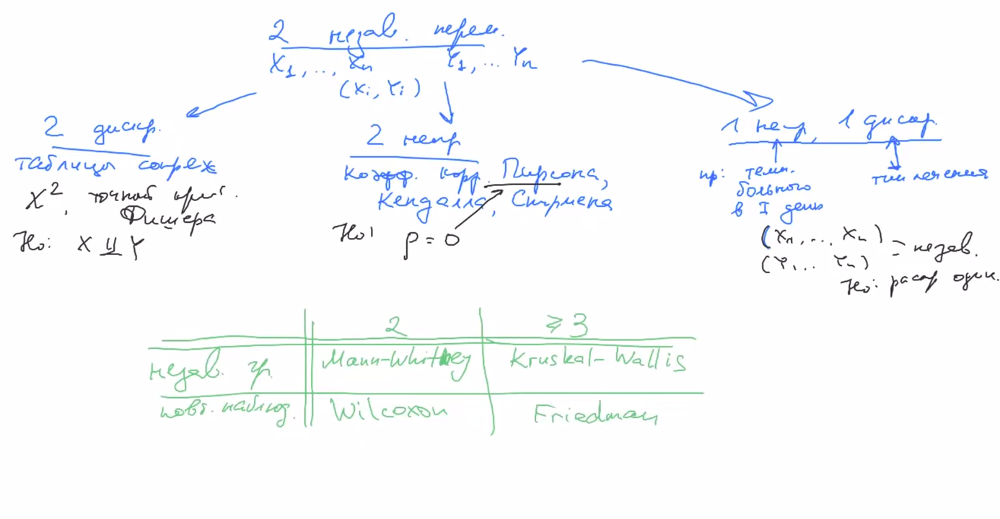

В третьем случае, когда одна переменная непрерывна, а другая дискретна, методы делятся на два типа: для независимых групп и для повторных наблюдений. Чтобы определить, с каким случаем мы имеем дело, надо задаться вопрос, можем ли мы посчитать попарные разности

Сегодня обсудим тесты Краскала-Уоллиса и Фридмана

# Kruskall-Wallis

### Пример

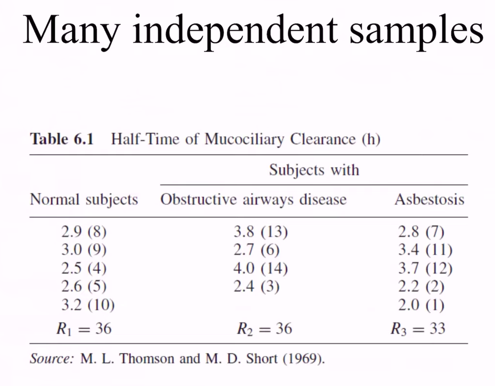

### Формализация

Несколько ($\> 3$) независимых групп. 

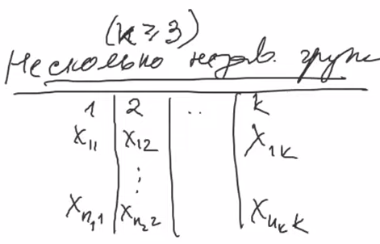

Модель выглядит так:
$$
x_{ij} = \Delta+\Delta_j+\e_{ij}
$$
где

* $\Delta$ - общая медиана
* $\Delta_j$ - медиана по группе
* $\e_{ij}$ - шум

Гипотеза:
$$
\begin{align*}
\Hh_0: &\quad \Delta_1 = \dots = \Delta_k \\
\Hh_1: &\quad \else
\end{align*}
$$
В теории, не должно быть повторяющихся данных. Но в реальности часто такое случается. В этом случае берут средний ранг: если два элемента равны и имеют ранги 3 и 4, то обоим дают средний ранг - 3.5. Это чисто прикладной подход, не основанный на теории.

Пусть $R_{ij}$ - ранг в общей выборке. Посчитаем средний ранг по группе (по столбцу):
$$
R_j = {1 \over n_j} \sum_i R_{ij}
$$

**Теорема**. Если выполнена $\Hh_0$, то 
$$
{12 \over N(N+1)} \sum_{j=1}^k n_j(R_j - {N+1 \over 2})^2 \to \Xx_{R-1}^2
$$
По сути этот тест является обобщением теста Манни-Уитни

### Связь с ANOVA

(aka однофакторный дисперсионный анализ)

Посчитаем *изменчивость по всей совокупности:*
$$
\sum \sum (X_{ij} - X_{\cdot \cdot})^2
$$
где

* $X_{\cdot \cdot}$ -  среднее по всей выборке

Преобразуем:
$$
\sum \sum (X_{ij} - X_{\cdot \cdot})^2 = \underbrace{\sum_{j=1}^k \sum_{i=1}^{n_j} (X_{ij} - X_j)^2}_{\text{изменчивость внутри группы}} + \underbrace{\sum_{j=1}^k n_j(X_{ij} - X_{\cdot \cdot})^2}_{\text{изменчивость между группами}}
$$
Это следует из теоремы Гюйгенса-Штейнера. Обозначим вещи выше:
$$
V_{tot} = V_{int} + V_{out}
$$
Теорема. Пусть $X_{ij} \sim N(\mu_j, \s^2)$. Если $\mu_1, \dots \mu_n$, то $V_{int} \sim \Xx_{N-k}^2$, $V_{out} \sim \Xx_{k - 1}^2$

Предположение о равенстве дисперсий довольно сильное, но есть тесты (критерий Баффлета), которые позволяют это проверить

Можно одновременно проверить оба условия, можно проверить следующее:
$$
{{1 \over k - 1} V_{out} \over {1 \over {N - k}} V_{int}} \sim F_{k-1, N-k} - \text{распределение Фишера}
$$
На основе этого работает метод ANOVA

Попробуем применить ANOVA для $R_{ij}$:
$$
V_{tot} = \sum \sum (R_{ij} - R_{\cdot \cdot})^2 = \sum_{i=1}^N (i - {N + 1 \over 2})^2
$$
Эта штука не зависит от выборки, а кроме того совпадает с выражением из асимптотической теоремы. Преобразуем: 
$$
{{1 \over k - 1} V_{out} \over {1 \over {N - k}} (V_{tot} - V_{out})} \sim F_{k-1, N-k}
$$
Получаем, что метод Краскала-Уоллиса и ANOVA базируются на одном и том же утверждении. Поэтому критерий КУ называют критерием непараметрического дисперсионного анализа.

# Критерий Фридмана

### Пример

Пример из бейсбола. Надо пробежать от home plate до second base мимо first base. Есть три стратегии, надо понять какая лучше.

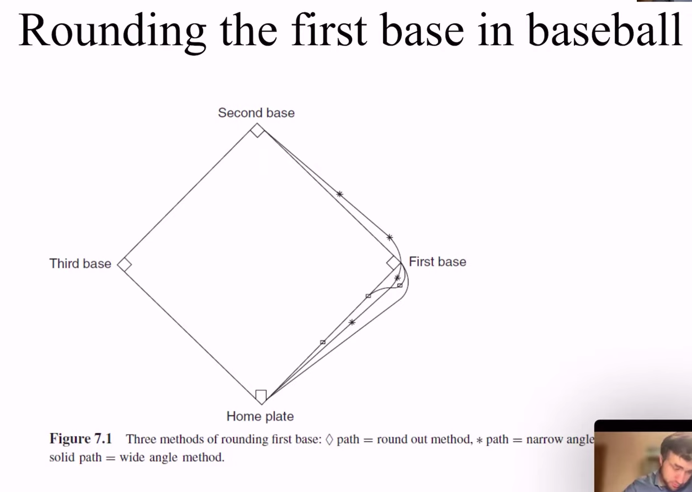

Результаты:

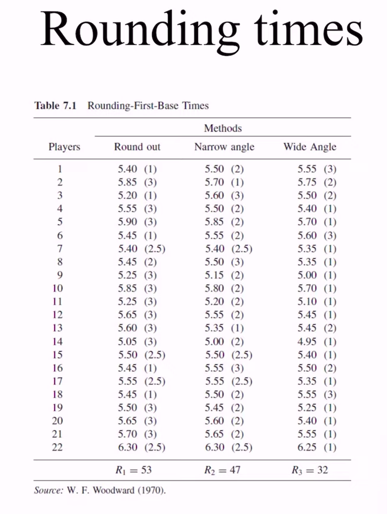

Наблюдения парные (одни и те же игроки)

### Формализация

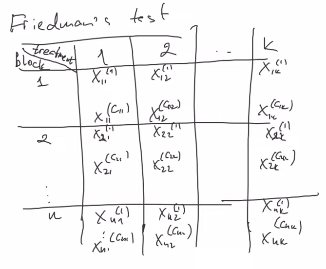

Модель:
$$
x_{ij}^(k) = \underset{\text{медиана}}{\theta} + \underset{\substack{\text{эффект блока} \\ \text{(способности игрока)}}}{\a_i} + \underset{\substack{\text{эффект обработки} \\ \text{(траектория)}}}{\beta_i} + \e_{ij}^{(k)}, \quad k = \overline{1, C_{ij}}
$$
Гипотеза:
$$
\begin{align*}
\Hh_0: & \quad \beta_1 = \dots \beta_k
\end{align*}
$$
Обозначения:
$$
r_{ij}^{(k)} = \rank(X_{ij}^{(k)}) - \text{внутри i-го блока} \\
R_{\cdot j} = {1 \over C_{11} + \dots + C_{n1}} \sum_{i =1}^n \sum_{j = 1}^{C_{ij}} r_{ij}^{(k)} \\
$$

### Асимптотическая теорема

Если $\Hh_0$ верна, то 
$$
{12 n \over k(k+1)} \sum_{j=1}^k (R_{\cdot j} - {k+1 \over 2})^2 \to \Xx_{k -1}^2
$$

# Регрессия

### Предыстрория

В 1885 Гальтон измерил рост родителей $X$ и рост детей $Y$. Он обнаружил, что $Y - \bar Y = {2 \over 3} (X - \bar X)$

Вообще термин регрессия немного депрессивный и намекает на уменьшение/затухание. В советской литературе этот термин был заменен словом прогрессия

### Линейная регрессия

Модель:
$$
(\vec{X_i}, Y_i), \ i = \overline{1, n}, \quad \dim X_i = m  \\
Y_i = (\vec{X_i}, \vec{\theta}) + \e_i, \quad \e_i \sim N(0, \s^2)
$$
Записываем в виде матрицы:

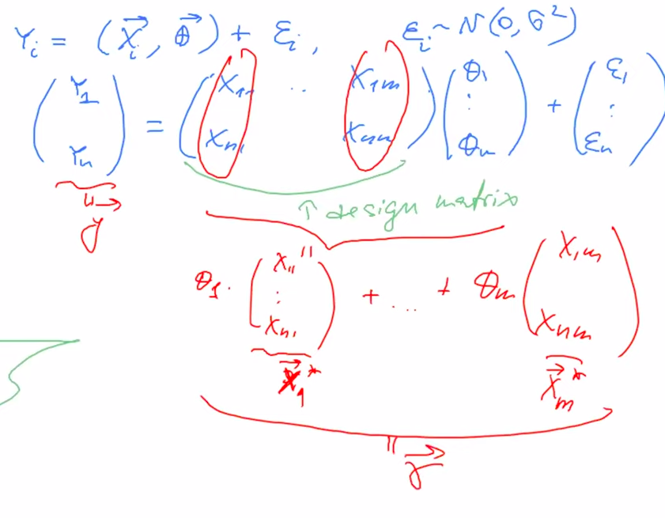

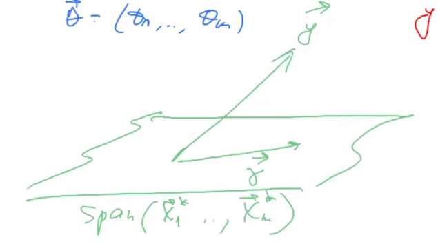

Как решать? МНК

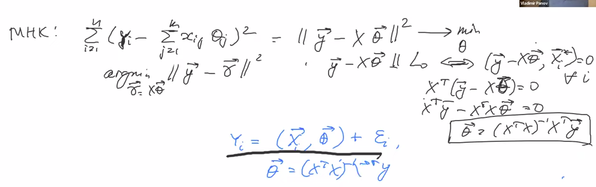

По сути наши предсказания являются л.к. y-ков:

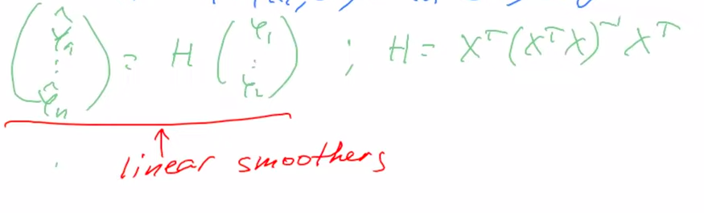

### Пример

А где тут матстатистика? На семинарх будем работать с датасетом mtcars. Будем решать следующие проблемы:

* Какие признаки лучше брать для предсказания? 
* Почему построенная модель лучше тривиальной (прогнозирующей константу)?

### Проблема уменьшения размерности

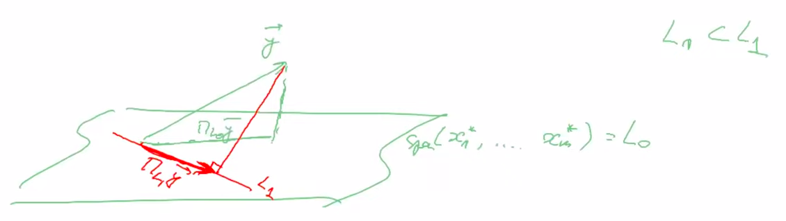

Пусть $L_1 \sub L_0$
$$
\vec{Y} = \vec{\g} + \vec \e, \quad \vec \g \in L_0, \ \e_i \in N(0, \s^2)
$$

**Теорема**. Пусть 
$$
\begin{align*}
\Hh_0: & \quad \vec \g \in L_1 \sub L_0
\end{align*}
$$
Если $\Hh_0$ верна, то
$$
{{1 \over n_0 - n_1} \| \proj_{L_0}\vec y - \proj_{L_1}  \vec y \|^2 \over {1 \over n - n_0} \| \vec y - \proj_{L_0} \vec y \|^2}
\sim F_{n_0 - n_2, n - n_0}
$$

### Связь с линейной корреляцией

Вспомним коэффициент $R^2$:
$$
R^2 = {\| \proj_{L_0}\vec y - \proj_{L_1}  \vec y \|^2 \over \| \vec y - \proj_{L_1}  \vec y \|^2} = \shift{\text{pifagorean theorem}} = 
{\| \proj_{L_0}\vec y - \proj_{L_1}  \vec y \|^2 \over \| \proj_{L_0}\vec y - \proj_{L_1}  \vec y \|^2 
+ \|\vec y - \proj_{L_0}  \vec y \|^2}
$$
Тогда можно переписать отверждение теоремы:
$$
{R^2 \over 1 - R^2} \cdot {n - n_0 \over n_0 - n_1} \sim F_{n_0 - n_1, n - n_0}
$$
Это похоже на теорему для коэффициента корреляции Пирсона. Возьмем в качестве $L_0$ пространство, натянутое на два вектора:
$$
\begin{align*}

& L_0 = \span(x_1^*, x_2^*), && y = a + bx + \e \\
& L_1 = \span(x_1^*), && y = a + \e
\end{align*}
$$
Тогда получаем
$$
{R^2 \over 1 - R^2} \cdot {n - 2 \over 1} \sim F_{1, n - 2} - \text{распределение Фишера} \\
F_{k, n} = {{1 \over k} (\xi_1^2 + \dots \xi_k^2) \over {1 \over n} (\xi_1^2 + \dots \xi_n^2)} \\
{R \over \sqrt{1 - R^2}} \sqrt{n- 2} \sim t_{n- 2} - \text{распределение Стьюдента}
$$
Почему совпадает???

# Связь коэффициента корреляции Пирсона и $R^2$

Выборка:
$$
(x_1, y_1), \dots (x_n, y_n)
$$
Коэффициент корреляции:
$$
\text{emp.cor}(x, y) = {\sum (x_i - \bar x)(y_i - \bar y) \over \sqrt{\sum(x_i - \bar x)^2} \sqrt{\sum(y_i - \bar y)^2}}
$$
Регрессионная зависимость:
$$
y_i = a + bx_i + \e_i
$$
С помощью МНК получаем $\hat a, \widehat b \hence \hat y_i = \hat a + \hat b x_i$

**Утверждение 1.** 
$$
|\text{emp.cor.(a + bx, y)} | = | \text{emp.cor. (x, y)}|
$$
*Доказательство*

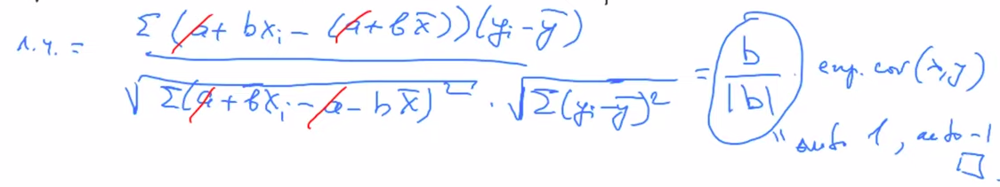

---

**Утверждение 2.**
$$
(\text{emp.cor.} (\hat y, y))^2 = R^2
$$
*Доказательство*

Запишем левую и правую часть. Явно посчитаем проекции

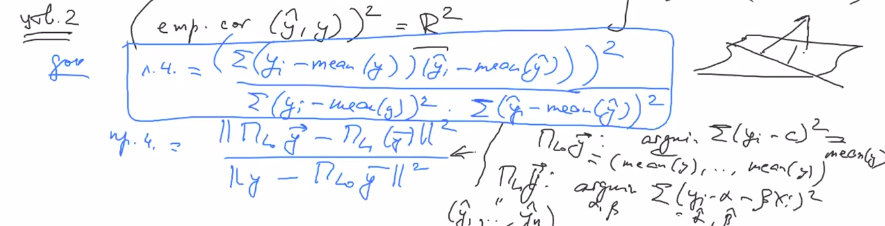

Значит, правая часть равна

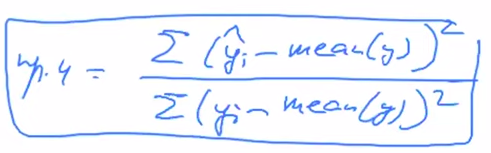

Заметим следующее:

Последнее тождество верно, что можно увидеть из картинки:

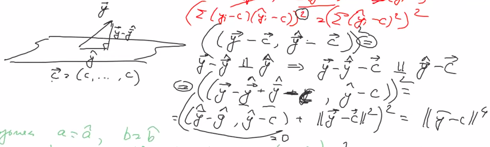

Осталось доказать, что $\text{mean}(y) = \text{mean}(\hat y)$. Вспоминаем школьную теорему о трех перпендикулярах:

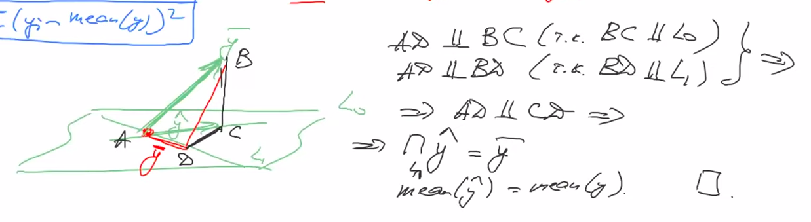

---

Возьмем $a = \hat a, b = \hat b$. Тогда
$$
\text{emp.cor.} (\hat y, y) = |\text{emp.cor.}(x, y)|
$$
Значит, 
$$
{R^2 = (\text{emp.cor.}(x, y))^2}
$$
Если утверждение 2 верно, то мы можем использовать теорему, выписанную ранее:
$$
\Hh_0: \ \g \in L_1 \hence {R \over \sqrt{1 - R^2}} \sqrt{n - 2} \sim t_{n-2} \\
$$
Условие $\g \in L_1$ эквивалентно равенству нулю линейной корреляции:
$$
\r = 0 \thesame \E [XY] = \E[X] \E[Y] \thesame \shift{Y = \a + \b X + \e} 
\thesame \a \E[X] + \b \E[X^2] = \E[X] (\a + \b \E[X]) \thesame \\
\thesame \b \var[X] = 0 \thesame \b = 0 \thesame \g \in L_1
$$
Поэтому анализ коэффициента корреляции Пирсона полностью эквивалентен анализу коэффициента $R^2$ в соответствующей модели.

# Обобщенные линейные модели

Пусть есть экспоненциальное распределение
$$
p(x, v) = g(x) \exp{xv - d(v)}
$$
и $Y \sim p(x, v)$. Пусть имеется выборка $(\bar X_0, Y_1), \dots, (\bar X_n, Y_n)$. Будем предполагать, что
$$
Y_i \sim p(x, (\bar x_i, \b))
$$

### Пример: логистическая регрессия

$$
Y \sim \begin{cases} 1, & \theta \\ 0, & 1 - \theta \end{cases}
$$

Плотность:
$$
p(x, \theta) = \t^x (1 - \t)^x = \exp{x \log{\t \over 1 - \t} + \log (1 - \t)}
$$
Таким образом,
$$
Y_i \sim \exp{x \langle y_i, \b \rangle - d(\langle y_i, \b \rangle)}, \ d(v) =\log(1 + e^v)
$$
Чтобы найти $\b$ используем метод максимального правдоподобия:
$$
\prod_{i=1}^n p(x_i, (y_i, \b))=\prod_{i = 1}^n \exp{x_i \langle y_i, \b \rangle - d(\langle y_i, \b \rangle)} \to \max_\b
$$

### Анализ качества логистической регрессии

#### Кривая ROC-AUC

Бинаризуем по порогу:

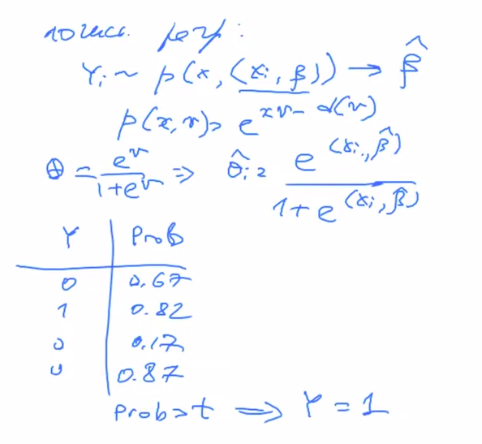

Подбор порога, вообще говоря, довольно важен. 

TPR и FPR:

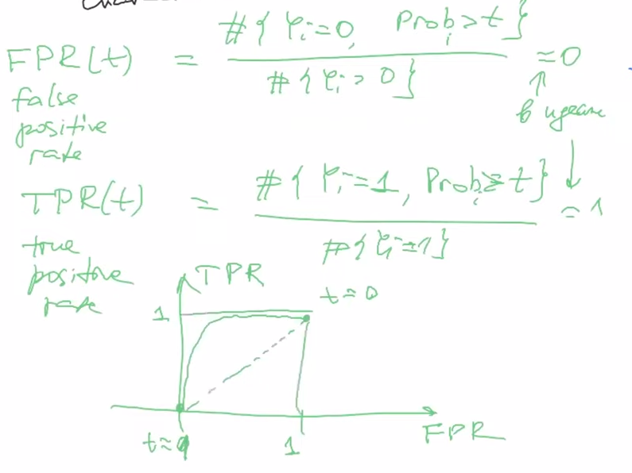

#### Теорема Уилкса

* Null deviance:
  $$
  \text{ND} = 2 \cdot \9 
  \underset{Y_i \sim p(x, v_i)}{\text{LogLikelyhood} (\text{saturated model})} -
  \underset{Y_i \sim p(x, v)}{\text{LogLikelyhood} (\text{null model})}
  \0 
  \to \Xx_{n - 1}^2
  $$

* Residual deviance:
  $$
  \text{RD} = 2 \cdot \9 
  \underset{Y_i \sim p(x, v_i)}{\text{LogLikelyhood} (\text{saturated model})} -
  \underset{Y_i \sim p(x, \langle \t,x_i\rangle)}{\text{LogLikelyhood} (\text{proposed model})}
  \0 
  \to \Xx_{n - (m+1)}^2
  $$

Когда мы оценивали линейную модель, то по сути сравнивали proposed model и saturated model. Чтобы оценить нашу модель просто посчитаем разность и применим статистический тест:
$$
\text{ND} - \text{RD} = 2 \cdot \9 
{\text{LogLikelyhood} (\text{proposed model})} -
{\text{LogLikelyhood} (\text{null model})}
\0 
\to \Xx_{m }^2
$$

#### Weights of evidence 

Пример: событие это уход клиента из банка. 

Стоит ли использовать переменную “возраст клиента” для предсказания оттока?

Разобьем на бины:

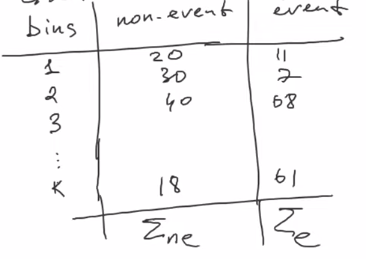

Статистика:
$$
\text{WoE}_i = \ln \9 {n e_i / \Sigma_{ne} \over e_i / \Sigma_{e}} \0
$$
где $i$ - номер бина. Inforation value:
$$
\text{IV} = \sum_{i = 1}^k \9 \underbrace{{n e_i \over \Sigma_{ne}}}_{g_i} - \underbrace{{e_i \over \Sigma_{e}}}_{h_i} \0 \cdot \text{WoE}_i = \sum (g_i - h_i) \ln (g_i / h_i ) = \sum g_i \ln (g_i / h_i) + \sum h_i \ln (h_i / g_i) \> 0
$$
Причем равенство достигается, когда $h = g$. Соответственно, чем меньше IV, тем хуже переменная. Какая-то таблица для определения качества:

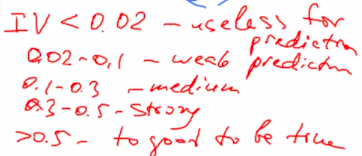

# Непараметрическая регрессия

### Kernel regression

$$
Y_i = r(X_i) + \e_i \\
\E[Y_i | X_i = x] = \E[r(X_i) | X_i = x] + \underbrace{\E[\e | X_i = x]}_{0} \\
\E[Y | X = x] = \int y p_{y | x}(y, x) \dx = \int y \cdot {p_{x, y}(x, y) \over p_x(x)} \dy 
$$

Мы не знаем обе плотности в последние интеграле. Будем использовать ядерные оценки:
$$
\hat p_x(x) = {1 \over nh} \sum_{i = 1}^n K({x_i - x \over h}) \\
\hat p_{(x, y)}(x, y) = {1 \over nh^2} \sum_{i = 1}^n K({x_i - x \over h}) K({y_i - y \over h})
$$
Подставляем:

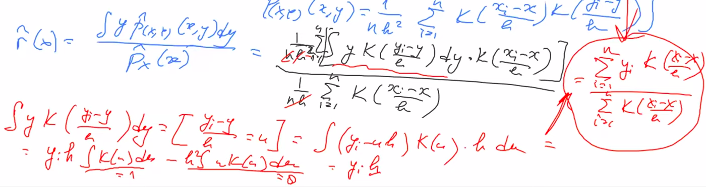

Итоговая оценка:
$$
\hat r(x) = {\sum_{i=1}^n y_i K({x_i - x \over h}) \over \sum_{i=1}^n K({x_i - x \over h})} - \text{Nadaraya-Watson}
$$
Утверждение. Оценка Надарая-Ватсона является решение оптимизационной задачи
$$
\argmin_\b \sum_{i = 1}^n (y_i - \b)^2 K({x - x_i \over h})
$$
Обобщение:
$$
\argmin_{\b_0, \b_1} \sum_{i = 1}^n (y_i - \b_0 -\b_1 x_i) K({x - x_i \over h})
$$

# Резюме

Регрессионные модели бывают двух типов - параметрические и непараметрические. Среди параметрических самая мощная - линейная регрессия, т.к. для нее существует много статистических тестов. 

Линейная регрессия плотно связана с корреляцией Пирсона: они обе использует одну и ту же теорему.

Существуют обобщения линейных моделей. Логистическая регрессия одна из них.
